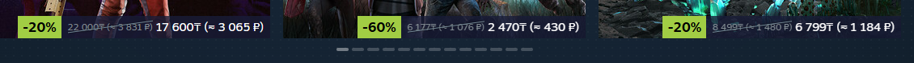
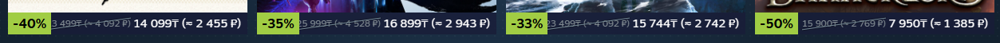

# 💱 KZT → RUB Converter  

Браузерное расширение для автоматической конвертации цен из тенге в рубли по курсу ЦБ РФ для сайта 🎮 [Steam](https://store.steampowered.com/)

## ✨ Возможности

- 🔍 Автоматически находит цены в KZT на странице  
- ⚡ Конвертирует их в RUB в реальном времени  
- 📈 Использует **официальный курс ЦБ РФ** (обновляется ежедневно)
- 💾 Кэширует курс на сутки → минимум запросов к серверу
- 🧠 Работает через **MutationObserver** — обновляет цены при динамической подгрузке контента  
- 🧹 Минимальное вмешательство в DOM — не ломает стили и верстку  

## 📸 Скриншоты




## 🚀 Установка и запуск

### 1. Установка Node.js

Если у вас ещё нет Node.js → скачайте и установите актуальную версию:

→ https://nodejs.org/

Проверить, что всё установилось:

```bash
node --v
npm --v
```

### 2. Клонирование и установка зависимостей

```bash
git clone https://github.com/vadimts0y/kzt_to_rub.git
```

```bash 
cd kzt_to_rub
```

```bash
npm init -y
```

```bash
npm install vite --save-dev
```

```bash
npm install vite-plugin-static-copy@3 -D
```

### 2. Сборка

```bash
npm run build
```

### 🧩 Установка расширения в браузер

Google Chrome / Microsoft Edge / Brave / Opera

1. Откройте браузер
2. Перейдите по адресу: chrome://extensions/
3. Включите «Режим разработчика»
4. Нажмите кнопку «Загрузить распакованное расширение»
5. Укажите папку dist
6. Готово! Расширение появится в списке и начнёт работать
